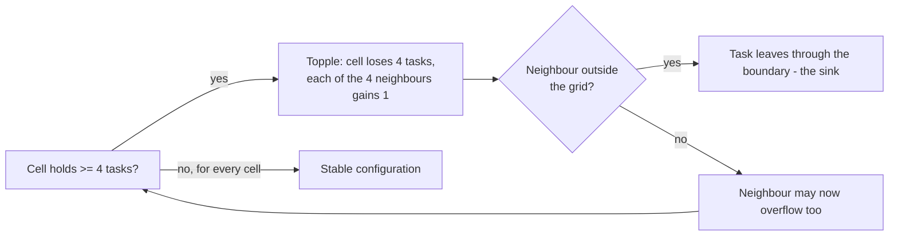

# Sandpile Load Balancer

**Modelling load balancing on a grid of servers with the Abelian sandpile (chip-firing) model, in Java 17.**

[](https://github.com/EduardoRochaFernandes/sandpile-load-balancer/actions/workflows/ci.yml)
[](LICENSE)


[](https://codespaces.new/EduardoRochaFernandes/sandpile-load-balancer)

## Why this exists

A first-year, first-semester university project (ISEP, LAPR1) that asked: *can a classic mathematical model of
avalanches be used to reason about how load spreads across a network of servers?* The original work was done by a team
of four; this repository is my later, independent refactor: a clean object-oriented domain model, a Maven build, JUnit 5
tests, CI, and documentation. It is a **learning / portfolio project, not a production load balancer.**

## Run it in one click

- **In the browser:** click the *Open in GitHub Codespaces* badge above. The dev container installs Java 21 and Maven and
  builds the project. Open `src/main/java/llbc/Main.java` and press **Run** (above `main`), or in the terminal:
  `java -jar target/sandpile-load-balancer-2.0.0.jar`
- **Locally** (Java 17+ and Maven 3.6+):

```bash
git clone https://github.com/EduardoRochaFernandes/sandpile-load-balancer.git
cd sandpile-load-balancer
mvn package                                              # compiles, runs the tests, builds the fat JAR
java -jar target/sandpile-load-balancer-2.0.0.jar        # guided demo
```

## The model

Servers form an *n x n* grid. Each cell holds the number of tasks queued on that server.



- **Stabilisation.** Keep toppling until every cell holds 0-3 tasks. On a grid with a sink the process always terminates,
  and the final state does **not** depend on the order of toppling (the *abelian* property) - that is the sandpile
  analogue of "independent balancing decisions commute".
- **Stabilised addition (⊕).** Add two load matrices cell by cell, then stabilise.
- **Recurrent configurations.** The stable states that can be reached again after adding more load. They form a finite
  abelian group under ⊕, with a **neutral element** and inverses. *Dhar's burning algorithm* tests whether a stable
  matrix is recurrent.
- **Group order = det(Δ̃)**, the determinant of the reduced Laplacian of the grid. Two independent implementations
  (brute force and determinant) are cross-checked in the demo (100352 for 3x3).

## What it does today

| Capability | Where |
|---|---|
| Toppling, stabilisation, stabilised addition, sweep counting | `llbc.core.SandpileMatrix` |
| Dhar's burning algorithm, brute-force recurrent count | `llbc.core.DharBurning` |
| Neutral-element check, inverse search (exhaustive) | `llbc.core.NeutralElement` |
| Reduced Laplacian and its determinant | `llbc.math.LaplacianMatrix` |
| Eigenvalues/eigenvectors: numerical (Apache Commons Math) and closed form | `llbc.math.EigenSolver` |
| "Resilience report" (see limitations) | `llbc.security.ResilienceAnalyser` |
| Strict CSV loading | `llbc.io.MatrixReader` |
| CLI: `demo`, `stabilise FILE.csv`, `resilience N`, `help` | `llbc.Main` |

62 JUnit 5 tests (run `mvn test`); CI runs them on Java 17 and 21 and smoke-tests the packaged JAR.

## Usage and real example output

```bash
java -jar target/sandpile-load-balancer-2.0.0.jar                       # demo
java -jar target/sandpile-load-balancer-2.0.0.jar stabilise input/matrix5.csv
java -jar target/sandpile-load-balancer-2.0.0.jar resilience 5
```

Output of `stabilise input/matrix5.csv` (captured from the CI run):

```
Initial load (5x5, 86 tasks):
[  5  6  0  1  5  ]
[  2  6  4  4  2  ]
[  3  0  0  4  3  ]
[  1  0  3  5  5  ]
[  6  6  6  3  6  ]
Stabilised after 8 sweep(s); 44 tasks left through the boundary (sink):
[  2  1  3  3  0  ]
[  2  0  2  1  1  ]
[  0  2  3  3  3  ]
[  3  1  2  1  2  ]
[  2  1  3  1  0  ]
Recurrent (Dhar's burning algorithm): true
```

Part of the default demo (3x3 grid):

```
Initial load (25 tasks):            Balanced after 1 toppling sweep(s) (4 tasks left through the boundary):
[  1  5  2  ]                       [  3  2  3  ]
[  4  4  2  ]                       [  2  2  3  ]
[  6  1  0  ]                       [  3  3  0  ]
...
4) Number of recurrent 3x3 configurations, two independent ways:
   brute force over all 4^9 = 262144 stable grids : 100352
   determinant of the reduced Laplacian            : 100352
```

(A "sweep" is one row-major pass over the grid that topples every cell currently at 4 or more.)

CSV input: one row per line, comma-separated non-negative integers, square matrix, 2 <= n <= 1000
([format](docs/guides/INPUT_FORMAT.md)).

### The original full CLI (pre-compiled)

The team's original 10-function CLI (heatmap export, inverse search, eigenvectors by flag, ...) is only available as a
**pre-compiled JAR** (`releases/final-release_1.0.0/main.jar`, built for **Java 21+**); its source is not in this repo.

```bash
./scripts/run.sh -f 7 -d 4 -o result.txt        # Windows: scripts\run.bat -f 7 -d 4 -o result.txt
```

See the [CLI reference](docs/guides/CLI_REFERENCE.md). CI executes several of these functions on every push.

## Complexity and limitations

- `toppleStep` / `isStable`: O(n²) per sweep; the number of sweeps depends on the input (no tight bound is claimed).
- Dhar's burning (`DharBurning.isRecurrent`): O(n²) per pass and up to n² passes, so **O(n⁴) worst case** in this simple
  multi-pass implementation (a queue-based version would be O(n²)).
- Brute-force counting, neutral-element check and inverse search enumerate all 4^(n²) stable grids: exponential, usable for
  n <= 3 (inverse search n <= 4 with patience).
- The Laplacian is stored densely (n² x n²): O(n⁴) memory and roughly O(n⁶) time for the numerical eigendecomposition,
  so `resilience` is capped at n = 20. The determinant is a floating-point value, rounded for display.
- The model is fixed: square grid, threshold 4, sink around the boundary. Real load balancers have other topologies,
  capacities and policies.
- **The "resilience report" is an analogy, not a validated security metric.** "Algebraic connectivity (λ₂)" is the
  second-smallest eigenvalue of the reduced (sink-grounded) grid Laplacian, and "spectral gap" is computed as
  λ_max − λ₂ (see `ResilienceAnalyser`); neither is the textbook Fiedler value or mixing-time gap of a graph. The
  [security write-ups](docs/security/RESILIENCE_ANALYSIS.md) are conceptual discussion.

## Status / roadmap

- Done: domain model, CSV loading, small CLI, tests, CI, dev container.
- Not done: the full CLI source (only the JAR exists), heatmap/GIF export in the Maven build, performance work
  (queue-based Dhar, sparse Laplacian, parallel inverse search), a sensible non-grid topology.

## Project structure

```
.
├── pom.xml                      Maven build (Java 17, JUnit 5, AssertJ, Commons Math 4)
├── src/main/java/llbc/
│   ├── Main.java                CLI entry point
│   ├── core/                    SandpileMatrix, DharBurning, NeutralElement, SandpileConfig
│   ├── io/                      MatrixReader
│   ├── math/                    LaplacianMatrix, EigenSolver, EigenResult
│   └── security/                ResilienceAnalyser
├── src/test/java/llbc/          JUnit 5 tests (62)
├── input/                       sample CSV load matrices
├── releases/final-release_1.0.0 original pre-compiled CLI + its sample inputs
├── scripts/                     run.sh / run.bat launchers for the original JAR
├── docs/                        architecture, guides, security notes
├── .devcontainer/               GitHub Codespaces (Java 21 + Maven)
└── .github/                     CI workflow, issue/PR templates, Dependabot
```

## Documentation

[Index](docs/INDEX.md) · [Architecture](docs/ARCHITECTURE.md) · [Getting started](docs/guides/GETTING_STARTED.md) ·
[CLI reference](docs/guides/CLI_REFERENCE.md) · [Input format](docs/guides/INPUT_FORMAT.md) ·
[Resilience analysis](docs/security/RESILIENCE_ANALYSIS.md) · [Threat model](docs/security/THREAT_MODEL.md) ·
[Changelog](CHANGELOG.md) · [Contributing](CONTRIBUTING.md) · [Security policy](SECURITY.md)

## Origin and licence

Developed in the LAPR1 course (Bachelor's in Informatics Engineering, ISEP - Instituto Superior de Engenharia do Porto)
as a group project by Bruno Silva, Afonso Martins, Martim Pereira and Eduardo Fernandes. The refactor in `src/` is
Eduardo Fernandes's independent work. The pre-compiled JAR in `releases/` is the original team build.

[MIT](LICENSE). The licence covers the refactored personal version of this project; the original academic work is subject
to the institution's academic policies. If you are a student with a similar assignment, use this only as a reference.

## Author

[Eduardo Fernandes](https://github.com/EduardoRochaFernandes)
