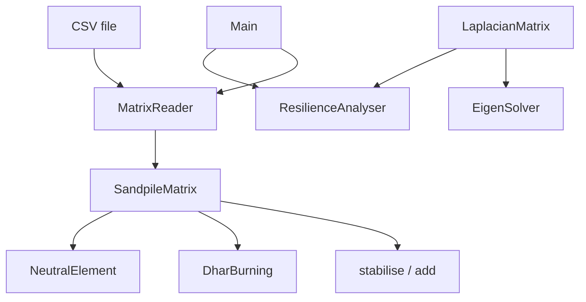

# Architecture

## What is in this repository

```
llbc.core      SandpileMatrix      toppling rule, stabilisation, stabilised addition (⊕)
               DharBurning         recurrence test (burning algorithm), brute-force count
               NeutralElement      neutral-element check, exhaustive inverse search
               SandpileConfig      constants (threshold 4, dimension limits)
llbc.math      LaplacianMatrix     reduced Laplacian (dense n² x n²) and determinant
               EigenSolver         eigen-decomposition: numerical (Commons Math) or closed form
               EigenResult         immutable eigenvalue/eigenvector pairs
llbc.io        MatrixReader        strict CSV parsing (square, non-negative integers)
llbc.security  ResilienceAnalyser  closed-form λ₂ / spectrum width + group-order report
llbc           Main                CLI: demo | stabilise FILE | resilience N | help
```

`core` and `math` have no I/O and are covered by unit tests; `Main` is the only class that prints (apart from
`ResilienceAnalyser.printReport`).



## The original CLI

The original team's full CLI (interactive menu and `-f/-a/-b/-d/-o` flags, heatmap export) is shipped only as the
pre-compiled `releases/final-release_1.0.0/main.jar` (built for Java 21+). Its source is not included here. See the
[CLI reference](guides/CLI_REFERENCE.md). The older design documents in `docs/diagrams/` describe that CLI.

## Limitations

- Brute-force routines (`countRecurrent`, `isNeutralElement`, `findInverse`) are O(4^(n²)); practical only for n <= 3 (inverse search n <= 4).
- The dense Laplacian costs O(n⁴) memory; `resilience` is limited to n <= 20.
- `DharBurning.isRecurrent` is a simple multi-pass loop, O(n⁴) worst case.
- Fixed model: square grid, threshold 4, boundary sink.
